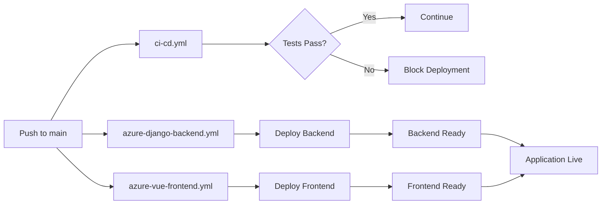

# GitHub Actions Workflows

This directory contains CI/CD workflows for the CPSU Virtual Health Assistant.

## 🚀 Active Workflows

### 1. `azure-django-backend.yml` - Backend Deployment
**Purpose**: Deploy Django backend to Azure Web App  
**Triggers**: 
- Push to `main` branch (when Django/ or ML/ files change)
- Manual workflow dispatch

**What it does**:
1. ✅ Sets up Python 3.11 environment
2. ✅ Installs dependencies
3. ✅ Trains ML model (disease_predictor_v2.pkl)
4. ✅ Runs Django deployment checks
5. ✅ Packages Django + ML files for deployment
6. ✅ Configures Azure Web App settings
7. ✅ Deploys to Azure App Service
8. ✅ Tests deployment health endpoint

**Required Secrets** (auto-created by Azure):
- `AZUREAPPSERVICE_CLIENTID_...`
- `AZUREAPPSERVICE_TENANTID_...`
- `AZUREAPPSERVICE_SUBSCRIPTIONID_...`

### 2. `azure-vue-frontend.yml` - Frontend Deployment
**Purpose**: Deploy Vue.js frontend to Azure Static Web Apps  
**Triggers**:
- Push to `main` branch (when Vue/ files change)
- Manual workflow dispatch

**What it does**:
1. ✅ Sets up Node.js 18 environment
2. ✅ Installs npm dependencies
3. ✅ Runs TypeScript type checking
4. ✅ Builds Vue production bundle
5. ✅ Deploys to Azure Static Web Apps
6. ✅ Configures SPA routing

**Required Secrets** (must be added manually):
- `AZURE_STATIC_WEB_APPS_API_TOKEN`

**Optional Secrets**:
- `VITE_API_BASE_URL` (defaults to Azure backend URL)
- `VITE_RASA_URL` (optional, for chatbot)

### 3. `ci-cd.yml` - Continuous Integration
**Purpose**: Test and validate code quality  
**Triggers**:
- Push to `main` or `develop` branches
- Pull requests to `main` or `develop`

**What it does**:
1. ✅ Runs Django unit tests with PostgreSQL
2. ✅ Checks Django migrations
3. ✅ Runs Vue type checking
4. ✅ Builds Vue production bundle
5. ✅ Lints Python code (flake8, black)
6. ✅ Security scanning (Trivy)

## 📋 Workflow Dependencies



## 🔧 Configuration

### Environment Variables

**Backend (Azure Web App Configuration)**:
```bash
DATABASE_URL=postgresql://...  # Supabase connection string
DJANGO_SECRET_KEY=...
DEBUG=False
DJANGO_ALLOWED_HOSTS=*.azurewebsites.net
CORS_ALLOWED_ORIGINS=https://your-frontend.azurestaticapps.net
PYTHONPATH=/home/site/wwwroot/Django
```

**Frontend (Azure Static Web App Configuration)**:
```bash
VITE_API_BASE_URL=https://your-backend.azurewebsites.net/api
VITE_APP_NAME=CPSU Health Assistant
VITE_APP_VERSION=1.0.0
```

### GitHub Secrets Setup

See [GITHUB_SECRETS_GUIDE.md](../../GITHUB_SECRETS_GUIDE.md) for detailed instructions.

## 🗂️ Old/Archived Workflows

The following files are kept for reference but not actively used:

- `azure-deploy.yml.old` - Original backend deployment (replaced by azure-django-backend.yml)
- `main_cpsu-health-assistant-backend.yml.old` - Azure auto-generated workflow (replaced)

## 🚦 Running Workflows Manually

### Via GitHub UI

1. Go to **Actions** tab
2. Select desired workflow from left sidebar
3. Click **Run workflow** button (top right)
4. Select branch (usually `main`)
5. Click **Run workflow**

### Via GitHub CLI

```bash
# Install GitHub CLI
# https://cli.github.com/

# Run backend deployment
gh workflow run azure-django-backend.yml

# Run frontend deployment
gh workflow run azure-vue-frontend.yml

# Run tests
gh workflow run ci-cd.yml
```

## 🔍 Monitoring Workflows

### View Workflow Runs

```bash
# List recent workflow runs
gh run list

# View specific run details
gh run view [run-id]

# View run logs
gh run view [run-id] --log
```

### Common Issues

**Issue**: Workflow fails with "secret not found"  
**Solution**: Check GitHub Secrets are configured correctly (see GITHUB_SECRETS_GUIDE.md)

**Issue**: Backend deployment fails with database error  
**Solution**: Verify DATABASE_URL is set in Azure Web App configuration

**Issue**: Frontend can't connect to backend  
**Solution**: Check CORS settings and VITE_API_BASE_URL

**Issue**: ML model not found error  
**Solution**: Ensure ML training step completed successfully in backend workflow

## 📚 Additional Resources

- [Azure Deployment Guide](../../AZURE_DEPLOYMENT_GUIDE.md)
- [GitHub Secrets Guide](../../GITHUB_SECRETS_GUIDE.md)
- [GitHub Actions Documentation](https://docs.github.com/en/actions)
- [Azure Web Apps Documentation](https://docs.microsoft.com/en-us/azure/app-service/)
- [Azure Static Web Apps Documentation](https://docs.microsoft.com/en-us/azure/static-web-apps/)

## 🆘 Support

For deployment issues:
1. Check workflow logs in GitHub Actions tab
2. Review Azure Application Insights for backend errors
3. Check Azure Static Web Apps logs for frontend issues
4. Consult the deployment guides linked above

---

**Last Updated**: February 2026  
**Maintained by**: CPSU Virtual Health Assistant Team
